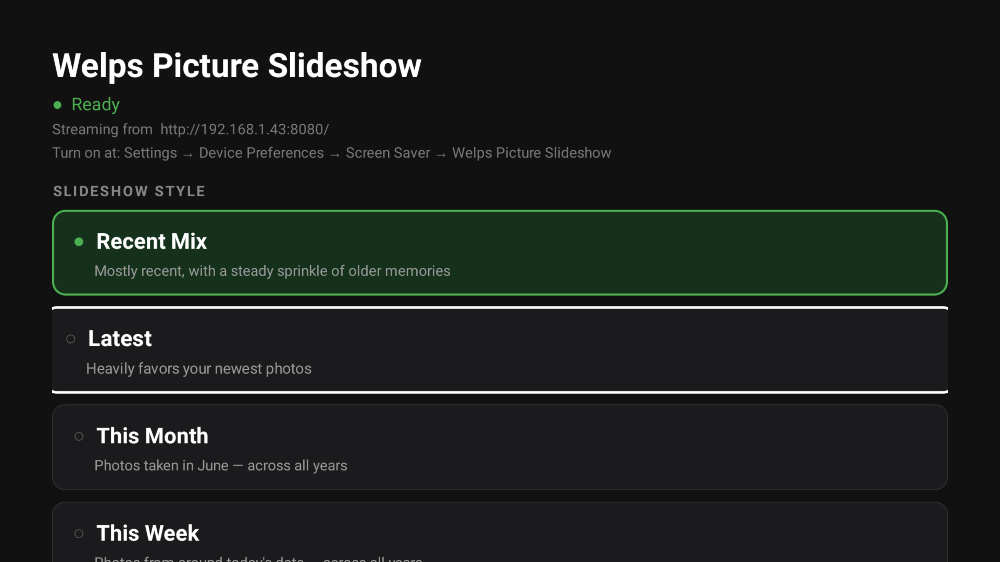

# 📺 Welps Picture Slideshow

A self-hosted photo screensaver for the **NVIDIA Shield TV** that streams your photo library
from a **Synology NAS** — private "memories on the big screen," no Google required.

> **Origin story:** this began as a session to debug Stardew Valley streaming lag. The culprit
> was a VPN kill-switch on the Shield... which — many hours later — turned out to *also* be the
> thing blocking this very app from reaching the NAS. The wifi debugging quietly became a whole
> photo platform. 🤷



## ✨ Features

- **Streams from your NAS** over HTTP — no cloud, no Google Photos API (which is dead for bulk access anyway)
- **On-demand selection** — every photo in the library is eligible on every pass, not a fixed daily batch
- **Live overlays** — clock, weather, and each photo's date + location (reverse-geocoded from EXIF GPS)
- **EXIF-aware** — correct orientation, and dates read from JPEG *and* HEIC
- **Slideshow styles** — weighted by recency (*Recent Mix*, *Latest*) or anniversary-style (*This Month*, *This Week*)
- **Library tooling** — migrate off Google (Takeout → dedupe → date-organize) and a reusable "add photos" workflow

## 🧱 How it works

```
Phone ──▶ Synology NAS  (library organized YYYY/MM)
                │   photosrv.sh: python http.server :8080  +  dated manifest
                ▼
        Shield app (DreamService)  ──▶  TV slideshow
```

The app fetches a manifest (`relpath|YYYYMMDD`), selects photos by the chosen style, and streams
them on demand with a small rolling cache and next-photo prefetch.

## 🛠 Build & deploy

```bash
# build the APK
ANDROID_HOME=/path/to/android-sdk gradle assembleDebug

# install on the Shield
adb -s <shield-ip>:5555 install -r \
  photos-screensaver/app/build/outputs/apk/debug/app-debug.apk
```

Configure in-app, or via ADB:

```bash
adb shell am start -n com.example.photossaver/.SetupActivity \
  --es nas_url "http://<nas-ip>:8080/" --es theme this_week
```

On the NAS, `photosrv.sh` serves the library and regenerates the dated manifest; run it at boot
via DSM **Task Scheduler → Triggered → Boot-up**.

## 📁 Repo layout

| Path | What |
|---|---|
| `photos-screensaver/` | The Android TV app (Kotlin, no XML layouts) |
| `photosrv.sh`, `gen_manifest.py` | NAS-side HTTP server + dated-manifest generator |
| `organize.py`, `dedupe_*`, `add_photos` | Library migration & maintenance tooling |
| `PROJECT_NOTES.md` | Full deep-dive notes |

## ⚠️ Lessons learned

- A **VPN kill-switch** (NordVPN) on the Shield silently blocks *all* app LAN traffic when its
  tunnel is disconnected — the root cause of endless "can't connect."
- Android blocks **cleartext HTTP** by default — needs `android:usesCleartextTraffic="true"`.
- **HEIC EXIF** isn't right after the `Exif\0\0` marker — locate the TIFF header directly.
- The **Google Photos Library API** is dead for bulk library access — use Takeout instead.

---

<sub>Built with [Claude Code](https://claude.com/claude-code).</sub>
